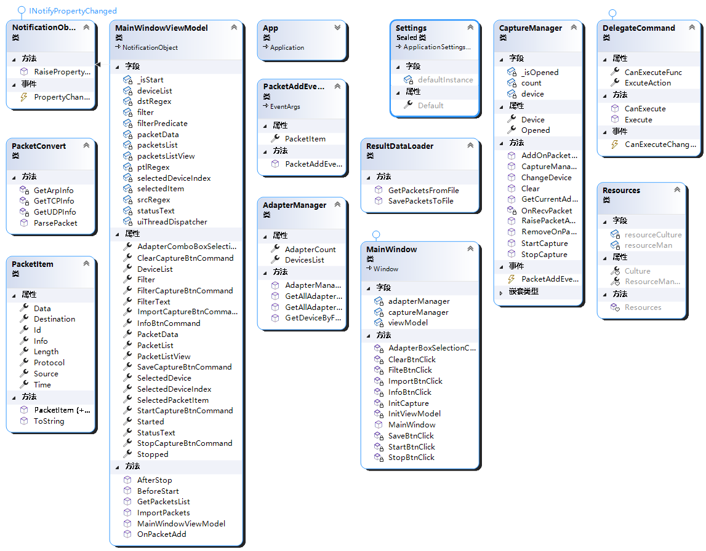
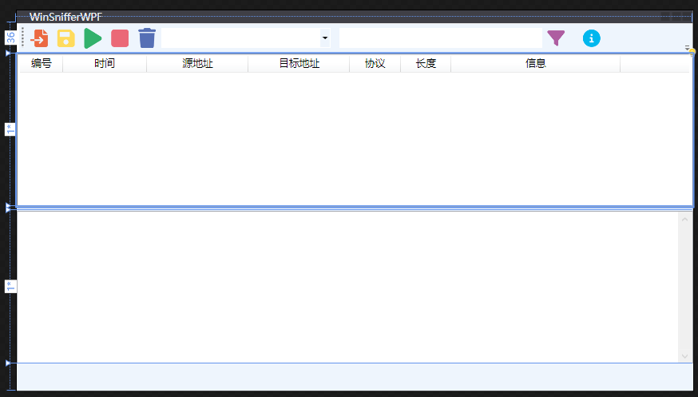
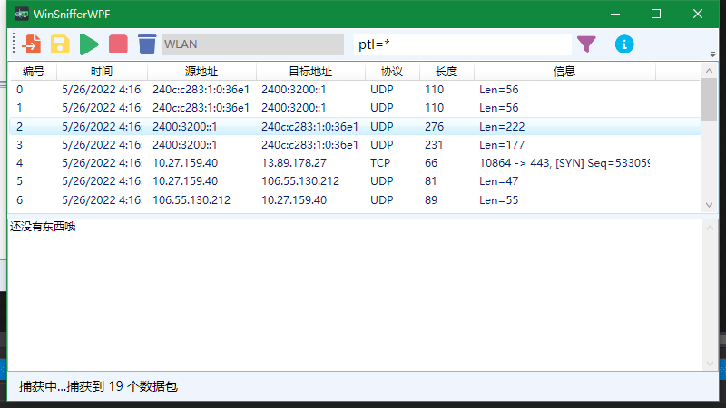
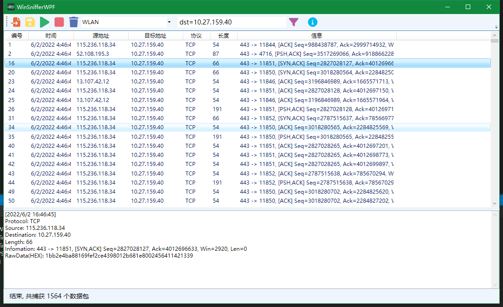
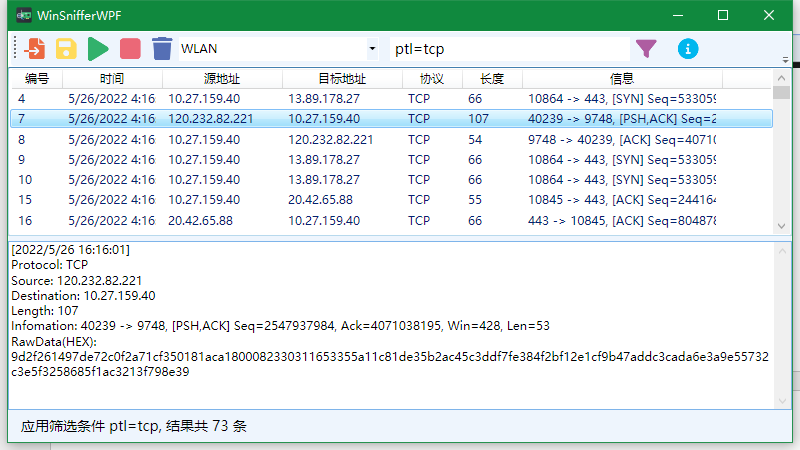
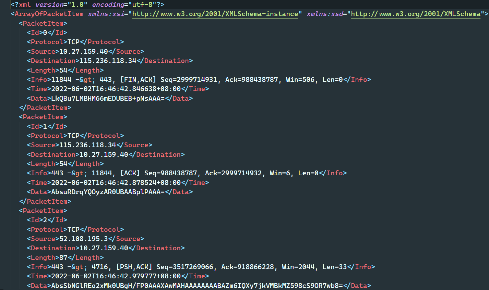
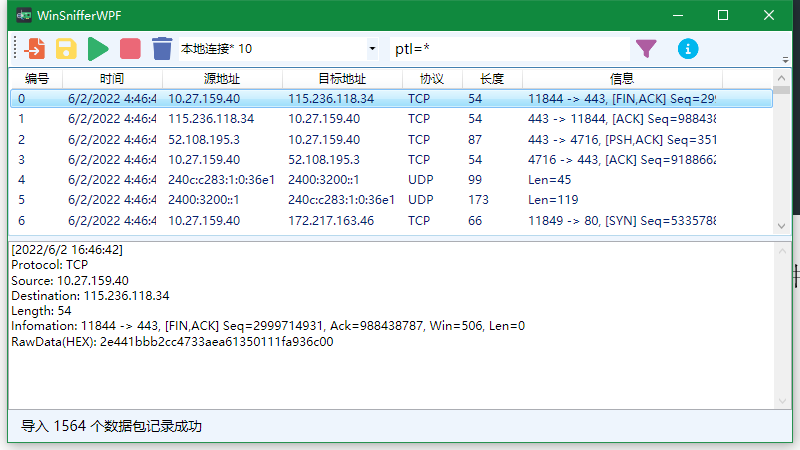

# WinSnifferWPF

  

基于WPF的简单抓包分析工具

## 注意

- 这是一个课程设计的作业，做的比较仓促，可能会有很多问题，**不建议**作为生产工具使用！
- 大量模(chao)仿(xi)wireshark的功能
- 对mvvm的实现较复杂

## 功能

1. 如果主机有多块网卡，用户可选定网卡；
2. 按照协议类型、源地址和目的地址过滤、查找数据帧（分组或数据段）；

<table>
  <thead>
    <tr>
      <td>名称</td>
      <td>表达式格式</td>
    </tr>
  </thead>
  <tbody>
    <tr>
      <td>按协议筛选</td>
      <td>ptl=&lt;协议名 | *&gt;</td>
    </tr>
    <tr>
      <td>按源地址筛选</td>
      <td>src=&lt;IP | 物理地址(仅arp) |*&gt;</td>
    </tr>
    <tr>
      <td>按目的地址筛选</td>
      <td>dst=&lt;IP | 物理地址(仅arp) | *&gt;</td>
    </tr>
  </tbody>
</table>

3. 实现IP分片的重组；
4. 支持分析结果的保存与读取；
5. 解析以太数据帧、IPv4、TCP、UDP、ARP、ICMP 协议数据；

## 依赖

### 需要事先安装的依赖

- [Npcap](https://npcap.com)

pcap（全称：packet capture）是一个用于捕获网络流量的应用程序接口（API），通过使用此接口可以捕获到原始数据包。
pcap是用C语言编写的，在 `类Unix` 系统中通过 `libpcap` 库来实现 `pcap` 接口，在 `Windows` 上则是通过 `Npcap` 库来实现，之前还有一个 `WinPcap库` 来实现，但目前 `WinPcap库` 已不再维护。

### nuget依赖

- [Microsoft.Xaml.Behaviors.Wpf](https://www.nuget.org/packages/Microsoft.Xaml.Behaviors.Wpf/1.1.39)
- [SharpPcap 6.2.1](https://www.nuget.org/packages/SharpPcap/6.2.1)
- [PacketDotNet 1.4.7](https://www.nuget.org/packages/PacketDotNet/1.4.7)
- [System.Buffers 4.5.1](https://www.nuget.org/packages/System.Buffers/4.5.1)
- [System.Memory 4.5.5](https://www.nuget.org/packages/System.Memory/4.5.5)
- [System.Numerics.Vectors 4.5.0](https://www.nuget.org/packages/System.Numerics.Vectors/4.5.0)
- [System.Runtime.CompilerServices.Unsafe 6.0.0](https://www.nuget.org/packages/System.Runtime.CompilerServices.Unsafe/6.0.0)
- [System.Text.Encoding.CodePages 7.0.0](https://www.nuget.org/packages/System.Text.Encoding.CodePages/7.0.0)

## 设计

### UML类图

### 界面设计

### 图标

控制按钮来源为 [Font Awesome](https://fontawesome.com/) 的 `SVG` 图标，经过我重新上色；软件的logo是我自己设计而成。

## 运行截图

### 抓包

开始抓包

停止抓包

### 筛选

ptl=tcp 筛选tcp数据包

### 导入导出

导出的抓包结果

上次保存的xml结果导入WinSnifferWPF

